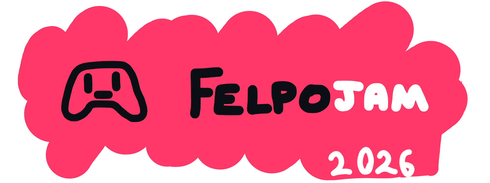

# NOME DO JOGO ( não temos ideia :v )



## evento organizado por

<div align="center">

<a href="https://www.felps.live">

</a>

<a href="https://www.c3b.fun">

</a>

</div>

## EquiPEI

Somos uma equipe séria, organizada e 100% funcional.
Nosso nome, EquiPEI, é uma sigla para: **E**quipe que **Q**uer **U**nir **I**mportancia **P**ara se **E**squivar de **I**mpostos.

Somos compostos de 5 integrantes:

- Lilozinhoinhovinho: Nosso princial programador com tempo livre até demais
- シコ: Nosso programador de suporte com pouquissímo tempo livre >;
- Nuvem: Nossa designer e principal artista de cenários e objetos
- Thur: Nosso principal artista de personagens
- Leo: Nosso incrível sonoplata.

## Instruções de Execução

Todo o código se encontra dentro da pasta felpojam-2026-game-code, para compilar-lo é necessário instalar o Godot Engine

Para garantir o funcionamento perfeitamente funcional do jogo é necessário enviar um pix de R$ 10,00 para a chave abaixo.

```PIX
fi-45ff8sll83a-aj912rgwpxufgd
```

## Instruções de gameplay

Você é o novo runista da palácio BlauBlum.

Como runista você deve fazer os pergaminhos que te forem pedidos pela corte do palácio, mesmo que os pedidos sejam bem vagos.

Para criar uma pergaminho é necessário juntar uma ou duas runas em uma papel. É possível tornar a runa mais potente usando o conta-gotas caso você ache necessário que a runa seja mais forte

## Controles

O jogo se baseia em uma gameplay de arrastar objetos usando o botão esquerdo do mouse. Existem dois modos de arraste:

- Segurar-Soltar: O mais comum e usado de padrão
- Clicar-Clicar: Para pessoas com dificultades em segurar o click

O jogo é divido em três telas, para se mover entre você pode usar uma das quatro maneiras:

- usando o espaço: você irá para a próxima tela
- usando as setinhas do teclado
- usando o scroll do mouse
- clicando nas setas na tela
